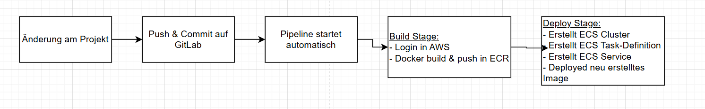
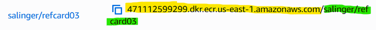

# Architecture Ref. Card 03 mit automatischer aktualisierung und deployment in AWS ECS
Spring Boot Application, welche bei jedem Push automatisch aktuellisiert und auf AWS ECS deployed.

## Voraussetzungen

- GitLab oder GitHub zur speicherung von Variabeln
- Zugang zu AWS ECR und ECS
- ECR-Repository erstellt

## CI/CD Variabeln angeben
Damit Änderung automatisch auf AWS deployed werden, muss man folgende CI/CD Variabeln angeben. Falls der Branch protected ist müssen die Variabeln ebenfalls protected sein.
- AWS_ACCESS_KEY_ID (zu finden unter: AWS Details -> AWS CLI)
- AWS_SECRET_ACCESS_KEY (zu finden unter: AWS Details -> AWS CLI)
- AWS_SESSION_TOKEN (zu finden unter: AWS Details -> AWS CLI)
- AWS_DEFAULT_REGION (zu finden unter: AWS Details -> AWS CLI -> Region)

- CI_AWS_ECR_REGISTRY (zu finden unter: AWS -> ECR -> URI bis "/", Gelb)
- CI_AWS_ECR_REPOSITORY_NAME (zu finden unter: AWS -> ECR -> URI ab "/", Grün)

Man muss die Pipeline einmal ohne die Folgenden Variabeln starten, damit dann ein ECS Cluster erstellt wird.
- VPC_ID (zu finden unter: ECS -> Clusters -> Cluster wàhlen -> Services -> Service wählen/erstellen -> Configuration and Networking)
- SUBNET_ID_1 (zu finden unter: ECS -> Clusters -> Cluster wàhlen -> Services -> Service wählen/erstellen -> Configuration and Networking)
- SUBNET_ID_2 (zu finden unter: ECS -> Clusters -> Cluster wàhlen -> Services -> Service wählen/erstellen -> Configuration and Networking)